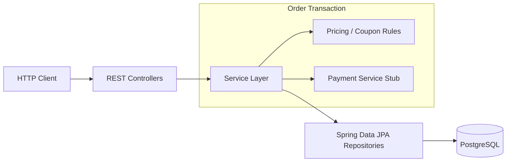
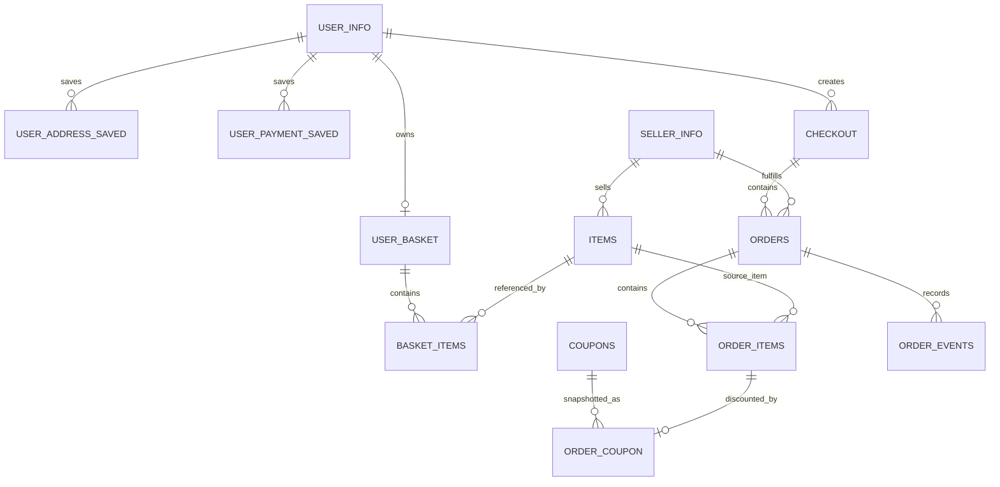

# E-Commerce Backend Portfolio

A backend-focused e-commerce project built with **Java 21, Spring Boot, JPA/Hibernate, and PostgreSQL**.

The goal of this project is not to reproduce a full commercial storefront. Instead, it focuses on backend problems that are easy to hide behind basic CRUD implementations: **transaction boundaries, concurrent stock updates, rollback behavior, immutable order history, coupon validation, integration testing, and reproducible containerized execution**.

The application supports users, sellers, items, baskets, order previews, direct purchases, basket checkout, coupons, saved addresses and payments, and order persistence. It can be run locally, with Docker Compose, or on a local Kubernetes cluster using Minikube.

---

## Highlights

- Transactional direct-purchase and basket-checkout flows
- Atomic inventory decrement to prevent overselling
- Concurrent last-item purchase test: two buyers compete for one unit and only one succeeds
- Full rollback verification when one item in a multi-item basket cannot be purchased
- Historical snapshots of item name, purchase price, shipping address, and coupon discount data
- Coupon validation for missing, expired, mismatched, and duplicate-per-item cases
- Basket checkout grouped by seller and persisted as separate orders under one checkout
- Integration tests against PostgreSQL with deterministic fixtures and transaction rollback
- MockMvc API tests for success and failure paths
- Dockerized Spring Boot + PostgreSQL environment
- Local Kubernetes deployment with Minikube, Deployment/Service wiring, and Pod self-healing verification

---

## Tech Stack

| Area | Technology |
| --- | --- |
| Language | Java 21 |
| Framework | Spring Boot 4.1 |
| Persistence | Spring Data JPA / Hibernate |
| Database | PostgreSQL 17 |
| Testing | JUnit 5, Spring Boot Test, MockMvc |
| Build | Gradle |
| Containerization | Docker, Docker Compose |
| Local orchestration | Kubernetes, Minikube |
| Version control | Git |

The application uses `spring.jpa.hibernate.ddl-auto=validate`, so Hibernate validates the mapped schema instead of silently creating or changing tables.

---

## Project Focus

A basic e-commerce backend can appear correct while still failing under realistic conditions.

For example:

1. Two requests read the same remaining stock.
2. Both believe the item is available.
3. Both decrement it.
4. The system oversells.

Another example:

1. A basket contains two products.
2. Stock for the first product is successfully decreased.
3. The second product is out of stock.
4. Without a proper transaction, the first decrement remains even though the order failed.

This project was developed around those kinds of consistency problems rather than only implementing endpoint coverage.

---

## High-Level Architecture



The application follows a conventional controller-service-repository structure, while transactional business rules are kept in the service layer.

---

## Domain Model

The main domain relationships are conceptually:



Important persistence concepts include:

- `UserInfo` and saved addresses/payments
- `SellerInfo`
- `Item`
- `UserBasket` and `BasketItem`
- `Checkout`
- `OrderEntity`
- `OrderItem`
- `Coupon`
- `OrderCoupon`
- `OrderEvent`

`OrderCoupon` is associated with the purchased `OrderItem`, allowing the discount used for a specific line item to be preserved independently of future coupon changes.

---

# Core Design Decisions

## 1. Atomic stock decrement

The order flow does not rely on the unsafe pattern:

```text
SELECT available
if enough:
    available = available - requested
    UPDATE item
```

Two concurrent transactions could both pass the check before either update becomes visible.

Instead, stock is decreased through a conditional database update. Conceptually:

```sql
UPDATE items
SET available = available - :quantity
WHERE item_code = :itemCode
  AND available >= :quantity;
```

The number of affected rows becomes the success condition:

```text
updated rows = 1 -> stock was reserved
updated rows = 0 -> insufficient stock
```

A failed update produces an `InsufficientStockException`.

This makes the database participate directly in enforcing the stock invariant instead of depending only on an earlier Java-side read.

---

## 2. Transactional basket checkout

Basket checkout is executed inside a Spring transaction.

A simplified flow is:

```text
validate request
    |
load user / basket / address
    |
validate and map coupons
    |
sort basket lines by item code
    |
calculate each line
    |
atomically decrease stock
    |
group totals by seller
    |
create Checkout
    |
create seller-specific Orders
    |
create OrderItems / OrderCoupons
    |
remove basket
    |
execute payment stub
    |
commit
```

If any exception escapes the transaction, database changes made in the transaction are rolled back.

Basket items are processed in item-code order to keep stock-update ordering deterministic when multiple rows are updated.

---

## 3. Rollback on partial basket failure

A particularly important case is:

```text
Basket
├── item A: stock available
└── item B: insufficient stock
```

The application may successfully decrease item A before discovering that item B cannot be purchased.

Because the entire operation is transactional, failure on item B rolls back the earlier stock change for item A as well.

A dedicated integration test verifies the database state after this failure rather than relying only on the thrown exception.

---

## 4. Concurrent last-item purchase

The project contains a concurrency test for the classic "last item" race.

Initial state:

```text
available = 1
```

Two worker threads are synchronized so they attempt the same purchase concurrently.

Expected invariant:

```text
successful purchases       = 1
insufficient-stock failures = 1
final available stock       = 0
```

The test verifies the invariant instead of assuming that sequential unit tests are sufficient evidence for concurrent behavior.

---

## 5. Immutable purchase snapshots

Orders should preserve what the customer actually purchased even when mutable source data changes later.

For that reason, order data stores snapshots such as:

- item name at purchase
- unit price at purchase
- shipping address at purchase
- coupon type/value/limit used
- actual discount applied

A snapshot integration test creates an order, changes the source item/address afterward, and verifies that the historical order still contains the original values.

This prevents old orders from being silently rewritten when catalogue or account data changes.

---

## 6. Coupon rules

The order flow validates coupon usage rather than treating a coupon code as a simple price subtraction.

Implemented checks include:

- coupon code exists
- coupon has not expired
- coupon belongs to the applicable item
- one item does not receive multiple supplied coupons in the same checkout
- unmatched supplied coupons are rejected
- fixed-price and percentage discounts are supported
- discount limits are applied
- discount cannot reduce the line below zero

Coupon information used at purchase time is also snapshotted into the order domain.

---

## 7. Order preview vs. order creation

Preview operations are read-only and do not create orders.

They calculate information needed before purchase, including:

- item/store grouping
- subtotal
- discount
- final amount
- available saved addresses
- available saved payment methods

Creation endpoints execute the actual transactional purchase flow.

This separates "show me what this checkout would look like" from "commit the purchase".

---

## 8. Multi-seller basket structure

Basket checkout groups items by seller.

A single checkout can therefore produce multiple seller-specific orders:

```text
Checkout
├── Order for Seller A
│   ├── OrderItem
│   └── OrderItem
└── Order for Seller B
    └── OrderItem
```

The checkout total is calculated across the seller groups while each `OrderEntity` remains associated with its seller.

The current project focuses more heavily on transactional correctness than on an exhaustive multi-seller scenario test matrix.

---

# Order API

Representative order endpoints:

| Method | Endpoint | Purpose |
| --- | --- | --- |
| `POST` | `/api/user/orders/preview/basket` | Preview the current basket |
| `POST` | `/api/user/orders/preview/item` | Preview a direct item purchase |
| `POST` | `/api/user/orders/basket` | Purchase the current basket |
| `POST` | `/api/user/orders/item` | Purchase one item directly |

The user UUID is currently supplied as a request parameter. Authentication/session integration is outside the current portfolio scope.

### Direct-purchase preview

```http
POST /api/user/orders/preview/item?userUuid=<uuid>
Content-Type: application/json
```

```json
{
  "itemCode": 1,
  "quantity": 2,
  "couponCode": "TEST_PRICE_1000"
}
```

### Direct purchase

```http
POST /api/user/orders/item?userUuid=<uuid>
Content-Type: application/json
```

```json
{
  "itemCode": 1,
  "quantity": 2,
  "couponCode": "TEST_PRICE_1000",
  "addressId": 3,
  "purchaseType": "CARD",
  "paymentId": 1
}
```

### Basket preview

```http
POST /api/user/orders/preview/basket?userUuid=<uuid>
Content-Type: application/json
```

```json
{
  "couponCodes": [
    "TEST_PRICE_1000"
  ]
}
```

### Basket purchase

```http
POST /api/user/orders/basket?userUuid=<uuid>
Content-Type: application/json
```

```json
{
  "couponCodes": [
    "TEST_PRICE_1000"
  ],
  "addressId": 3,
  "purchaseType": "CARD",
  "paymentId": 1
}
```

---

# Testing Strategy

This project uses integration-heavy tests because transaction and database behavior are part of what is being tested.

The completed test suite includes coverage for areas such as:

- direct purchase success
- direct purchase with coupon
- basket purchase success
- price/name/address snapshot preservation
- invalid coupon
- expired coupon
- coupon/item mismatch
- insufficient stock
- basket rollback after a later stock failure
- concurrent purchase of the final unit
- basket repository/service behavior
- basket controller behavior
- order preview API
- order creation API
- invalid quantities
- unknown items
- insufficient-stock HTTP responses
- invalid request JSON / error handling

The Gradle test suite is currently passing.

## Deterministic database fixtures

An early version of the tests depended too heavily on the existing development database state.

For example, tests assumed a basket would keep a specific identity value such as:

```text
basket_id = 1
```

That is fragile because PostgreSQL sequences are not rolled back just because the surrounding transaction is rolled back.

The tests were changed to:

1. establish the required fixture state in `@BeforeEach`
2. query entities through domain identifiers such as the user UUID rather than hard-coded generated IDs
3. execute each normal integration test inside a test transaction
4. roll the fixture and test mutations back after the test

Concurrency and service-rollback tests that need to observe real transaction boundaries are kept separate from an outer test transaction and explicitly restore their modified state.

This removed order-dependent test failures caused by shared development data.

---

# Running the Project

## Prerequisites

For a normal local run:

- Java 21
- PostgreSQL
- Git

For the containerized path:

- Docker Desktop / Docker Engine
- Docker Compose

For the Kubernetes demo:

- `kubectl`
- Minikube
- Docker

---

## Local database configuration

The default local PostgreSQL configuration is:

```text
database: personal_db
host:     localhost
port:     5433
user:     personal_user
```

The datasource supports environment overrides.

Conceptually:

```yaml
spring:
  datasource:
    url: ${DB_URL:jdbc:postgresql://localhost:5433/personal_db}
    username: ${DB_USERNAME:personal_user}
    password: ${DB_PASSWORD:personal_password}
```

The committed/demo password is intended only for local development.

Because Hibernate uses:

```yaml
ddl-auto: validate
```

the database schema must already exist before application startup.

---

## Run tests

Windows PowerShell:

```powershell
.\gradlew.bat test
```

Linux/macOS:

```bash
./gradlew test
```

---

## Build executable JAR

Windows:

```powershell
.\gradlew.bat bootJar
```

Linux/macOS:

```bash
./gradlew bootJar
```

The resulting JAR is produced under:

```text
build/libs/
```

---

# Docker

## Application image

The application is packaged into a Java 21 runtime image.

The Dockerfile follows the simple runtime model:

```dockerfile
FROM eclipse-temurin:21-jre

WORKDIR /app

COPY build/libs/portfolio-0.0.1-SNAPSHOT.jar app.jar

EXPOSE 8080

ENTRYPOINT ["java", "-jar", "app.jar"]
```

Build manually with:

```bash
docker build -t portfolio-app:local .
```

---

## Docker Compose

Docker Compose runs:

```text
Spring Boot container
        |
        | jdbc:postgresql://postgres:5432/personal_db
        v
PostgreSQL container
```

The Spring application does **not** use `localhost` to find PostgreSQL inside the Compose network. It resolves the database through the Compose service name `postgres`.

The containerized PostgreSQL instance is exposed on a separate host port so it does not collide with the existing development PostgreSQL instance.

The database schema is initialized from:

```text
docker/init.sql
```

This file is a schema-only PostgreSQL dump. It intentionally does not copy the developer's local test data.

### Start

Build the JAR first:

```bash
./gradlew bootJar
```

Then:

```bash
docker compose up --build
```

Detached mode:

```bash
docker compose up -d --build
```

Check status:

```bash
docker compose ps
```

### Stop

```bash
docker compose down
```

To intentionally remove the PostgreSQL Compose volume as well:

```bash
docker compose down -v
```

`-v` deletes the persisted container database volume and should not be used when the data should be preserved.

---

# Kubernetes / Minikube

Kubernetes support in this repository is intentionally a **local learning/deployment exercise**, not a claim of production Kubernetes experience.

The local deployment demonstrates:

- Minikube cluster creation
- Deployment-managed Pods
- ClusterIP service discovery
- NodePort/local service access
- environment-based Spring datasource configuration
- Kubernetes Secret usage for database credentials
- ConfigMap-based PostgreSQL schema initialization
- loading a locally built application image into Minikube
- Deployment reconciliation after a Pod is deleted

## Start Minikube

```bash
minikube start --driver=docker
```

Check the node:

```bash
kubectl get nodes
```

---

## Load the local application image

Build the application image:

```bash
docker build -t portfolio-app:local .
```

Load it into Minikube:

```bash
minikube image load portfolio-app:local
```

---

## Create local database configuration

Create the demo Secret:

```bash
kubectl create secret generic portfolio-db-secret \
  --from-literal=POSTGRES_DB=personal_db \
  --from-literal=POSTGRES_USER=personal_user \
  --from-literal=POSTGRES_PASSWORD=personal_password
```

PowerShell equivalent:

```powershell
kubectl create secret generic portfolio-db-secret `
  --from-literal=POSTGRES_DB=personal_db `
  --from-literal=POSTGRES_USER=personal_user `
  --from-literal=POSTGRES_PASSWORD=personal_password
```

Load the schema SQL as a ConfigMap:

```bash
kubectl create configmap postgres-init \
  --from-file=01-init.sql=./docker/init.sql
```

---

## Deploy PostgreSQL and the application

```bash
kubectl apply -f ./k8s/postgres.yaml
kubectl apply -f ./k8s/app.yaml
```

Check:

```bash
kubectl get pods
kubectl get services
```

Expected conceptual state:

```text
portfolio-app-...   1/1   Running
postgres-...        1/1   Running
```

The application connects internally to:

```text
jdbc:postgresql://postgres:5432/personal_db
```

where `postgres` is the Kubernetes Service name rather than a fixed Pod IP.

---

## Access the API

```bash
minikube service portfolio-app --url
```

This returns a local URL that can be used with a browser, Postman, or `curl`.

Example:

```bash
curl -i "<MINIKUBE_URL>/api/user/basket?userUuid=<uuid>"
```

The schema-only container database contains no development seed users/items unless they are inserted separately.

---

## Observe Kubernetes reconciliation

Delete the application Pod:

```bash
kubectl delete pod -l app=portfolio-app
```

Watch Pods:

```bash
kubectl get pods -w
```

The Deployment sees that the actual replica count has fallen below the declared replica count and creates a replacement Pod automatically.

This was manually verified during development.

---

## Stop Minikube

Keep the cluster but stop it:

```bash
minikube stop
```

Resume later:

```bash
minikube start
```

Delete the local cluster completely:

```bash
minikube delete
```

---

# Current Limitations

This is a portfolio backend, not a production commerce platform.

Important limitations are intentionally documented rather than hidden.

### Payment is a stub

`UserPaymentService` currently represents payment behavior inside the application.

A real external payment provider cannot be rolled back by a JPA database transaction.

A production implementation would need a design such as:

- payment pending / confirmation states
- idempotency keys
- compensation/refund behavior
- retry policy
- possibly an outbox/event-driven workflow

The current code deliberately does not claim to solve distributed payment consistency.

### Authentication is not production-ready

The current focus is backend domain behavior, not a completed authentication/authorization system.

Requesting a user by UUID is convenient for the portfolio API but would not be an acceptable authorization boundary in production.

### Kubernetes is local-only

The Minikube deployment proves the application can be containerized, networked, and managed by Kubernetes primitives locally.

It does **not** currently include a production deployment stack such as:

- managed Kubernetes
- Ingress/TLS
- Horizontal Pod Autoscaling
- resource tuning
- monitoring/observability
- production secret management
- CI/CD
- production database operations

### Kubernetes PostgreSQL storage is not production-grade

The current Minikube PostgreSQL manifest is deliberately lightweight and does not provide a production-grade persistent database setup.

A real deployment should use persistent volumes or, more commonly, a managed database rather than treating PostgreSQL as a disposable application Pod.

### No real external payment transaction

The transactional guarantees demonstrated in this repository apply to the PostgreSQL/JPA transaction. They do not imply atomicity across an external payment network.

---

# Development Process and AI Assistance

This project used ChatGPT as a **pair-programming, review, and learning tool**. The distinction between project ownership and AI assistance is documented here deliberately.

## Work performed by the project owner

The project owner:

- selected the project scope and backend focus
- designed and repeatedly revised the relational schema
- decided business rules for baskets, orders, coupons, inventory, addresses, order status, and snapshots
- implemented the main Spring Boot application structure
- implemented entities, repositories, services, DTOs, controllers, and exception behavior
- implemented and revised the order and basket flows
- chose the atomic stock-decrement approach and integrated it into the service
- made design decisions around transaction boundaries and order-history snapshots
- ran the application and database locally throughout development
- integrated tests into the codebase, interpreted failures, and fixed application/test-fixture issues
- executed the complete Gradle test suite until it passed
- built and ran the Docker image and Docker Compose environment
- installed/configured Minikube, deployed the application, inspected failures, corrected configuration, called the API, and manually verified Pod replacement
- made the final decisions about which suggested changes to keep or reject

The project owner therefore remains responsible for the architecture, implementation, debugging, and final behavior of the repository.

## Work assisted by ChatGPT

ChatGPT was used for:

- schema and domain-model review
- discussing trade-offs in order/coupon relationships and transaction design
- identifying edge cases worth testing
- explaining atomic database updates and transaction rollback behavior
- drafting portions of JUnit/Spring Boot integration tests at the owner's request
- drafting portions of MockMvc controller tests
- suggesting deterministic test-fixture/reset patterns after tests became dependent on shared PostgreSQL state
- drafting the rollback and two-thread concurrency test structure
- reviewing test failures and helping identify incorrect assumptions such as hard-coded generated basket IDs
- drafting the Dockerfile, Docker Compose configuration, and associated commands
- drafting the initial Minikube/Kubernetes manifests and setup commands
- explaining Docker networking, Kubernetes Services, Deployments, Pods, Secrets, and ConfigMaps
- helping diagnose container/Kubernetes startup issues, including datasource configuration
- drafting this README

In particular, some test and infrastructure configuration code was AI-drafted rather than typed from scratch by the project owner. The owner reviewed, integrated, executed, debugged, and validated that code in the actual project.

ChatGPT did **not** autonomously build or run the repository, make final project decisions, or independently verify behavior outside the development sessions performed by the owner.

This disclosure is included because the project is intended to represent both the owner's backend engineering work and the actual development process accurately.

---

# What This Project Demonstrates

The strongest part of this repository is not the number of endpoints.

It demonstrates an attempt to reason about backend correctness:

```text
What happens if two purchases race?

What happens if half of a basket succeeds before the next item fails?

What data must remain unchanged after the source record changes?

Which operations belong inside the same transaction?

Which guarantees stop at the database boundary?

How can tests prove those behaviors rather than only exercise happy paths?

Can another environment start the application without reproducing the
developer's workstation manually?
```

The resulting project is intentionally still small enough to understand end-to-end, while going beyond a CRUD-only implementation in the areas of **transactions, concurrency, persistence design, testing, and deployment reproducibility**.
