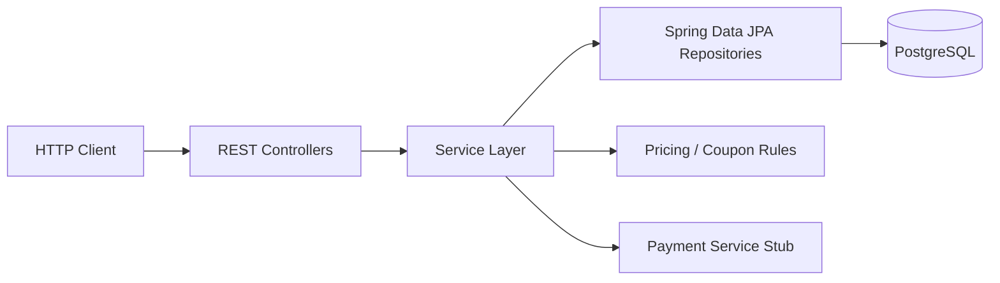

# E-Commerce Backend Portfolio

A backend-focused e-commerce project built with **Java 21, Spring Boot, JPA/Hibernate, and PostgreSQL**.

Rather than reproducing a full commercial storefront, this project focuses on backend correctness: **transaction boundaries, concurrent stock updates, rollback behavior, immutable order history, coupon validation, integration testing, and reproducible containerized execution**.

## Highlights

- Transactional direct-purchase and basket-checkout flows
- Atomic inventory decrement to prevent overselling
- Concurrent last-item purchase test: two buyers compete for one unit and only one succeeds
- Full rollback when a later basket item cannot be purchased
- Immutable snapshots of item name, purchase price, shipping address, and coupon discount data
- Multi-seller basket checkout with integration and MockMvc API tests

## Tech Stack

| Area | Technology |
| --- | --- |
| Language | Java 21 |
| Framework | Spring Boot 4.1 |
| Persistence | Spring Data JPA / Hibernate |
| Database | PostgreSQL 17 |
| Testing | JUnit 5, Spring Boot Test, MockMvc |
| Build | Gradle |
| Containerization | Docker, Docker Compose |
| Local orchestration | Kubernetes, Minikube |
| Version control | Git |

The application uses `spring.jpa.hibernate.ddl-auto=validate`, so the mapped schema is validated rather than created or modified automatically.

## High-Level Architecture



Transactional business rules are kept in the service layer.

## Core Design Decisions

### 1. Atomic stock decrement

The order flow does not rely on a read-then-update pattern such as:

```text
SELECT available

if enough:
    available = available - requested
    UPDATE item
```

Two concurrent transactions could both pass the stock check before either update becomes visible.

Instead, stock is decreased through a conditional database update:

```sql
UPDATE items
SET available = available - :quantity
WHERE item_code = :itemCode
  AND available >= :quantity;
```

The affected-row count becomes the success condition:

```text
1 row updated -> stock reserved
0 rows updated -> insufficient stock
```

This lets the database enforce the stock invariant directly.

### 2. Transactional basket checkout

Basket checkout is executed inside a Spring transaction.

A simplified flow is:

```text
validate request
    |
load user / basket / address
    |
validate coupons
    |
sort basket lines by item code
    |
calculate pricing
    |
atomically decrease stock
    |
group totals by seller
    |
create Checkout
    |
create seller-specific Orders
    |
create OrderItems / OrderCoupons
    |
remove basket
    |
execute payment stub
    |
commit
```

If an exception escapes the transaction, database changes made during the purchase are rolled back.

Basket items are processed in item-code order so stock updates occur in a deterministic order.

### 3. Rollback on partial basket failure

Consider a basket where item A has stock but item B does not.

The application may successfully decrease item A before discovering that item B cannot be purchased. Because the entire checkout runs inside one transaction, the earlier stock change for item A is rolled back as well.

A dedicated integration test verifies the database state after this failure.

### 4. Concurrent last-item purchase

The project includes a concurrency test for the classic last-item race.

Initial state:

```text
available = 1
```

Two worker threads attempt to purchase the same item concurrently.

Expected invariant:

```text
successful purchases          = 1
insufficient-stock failures   = 1
final available stock         = 0
```

The test verifies the final database state rather than relying only on sequential unit tests.

### 5. Immutable purchase snapshots

Orders preserve the values used at purchase time even if source records change later.

Snapshots include:

- item name
- unit price
- shipping address
- coupon type/value/limit
- actual discount applied

A snapshot integration test creates an order, modifies the source item/address afterward, and verifies that the historical order still contains the original values.

### 6. Coupon and multi-seller rules

Coupon validation includes:

- coupon existence
- expiration
- item applicability
- duplicate-per-item rejection
- unmatched supplied coupon rejection
- fixed-price and percentage discounts
- discount limits
- preventing a discount from reducing a line below zero

Basket checkout groups items by seller. One checkout can therefore contain multiple seller-specific orders.

```text
Checkout
├── Order for Seller A
│   ├── OrderItem
│   └── OrderItem
└── Order for Seller B
    └── OrderItem
```

## Representative Order API

| Method | Endpoint | Purpose |
| --- | --- | --- |
| `POST` | `/api/user/orders/preview/basket` | Preview the current basket |
| `POST` | `/api/user/orders/preview/item` | Preview a direct item purchase |
| `POST` | `/api/user/orders/basket` | Purchase the current basket |
| `POST` | `/api/user/orders/item` | Purchase one item directly |

Preview operations are read-only. Order creation endpoints execute the transactional purchase flow.

The user UUID is currently supplied as a request parameter; authentication/session integration is outside the current portfolio scope.

## Testing

The test suite includes coverage for:

- direct purchase success
- direct purchase with coupon
- basket purchase success
- item/price/address snapshot preservation
- invalid, expired, and mismatched coupons
- insufficient stock
- rollback when a later basket item fails
- concurrent purchase of the final unit
- basket repository/service behavior
- basket controller behavior
- order preview API
- order creation API
- invalid quantities
- unknown items
- insufficient-stock HTTP responses
- invalid request JSON / error handling

The Gradle test suite is currently passing.

### Deterministic database fixtures

Early tests depended too heavily on existing development database state and generated identity values.

The tests were revised to:

1. establish required fixture state in `@BeforeEach`
2. query entities through domain identifiers instead of hard-coded generated IDs
3. run normal integration tests inside test transactions
4. roll back fixture and test mutations after each test

Concurrency and rollback tests that need real transaction boundaries are kept separate from an outer test transaction and restore their modified state explicitly.

## Running

### Prerequisites

For a normal local run:

- Java 21
- PostgreSQL
- Git

For the containerized path:

- Docker
- Docker Compose

For the optional Minikube deployment:

- `kubectl`
- Minikube
- Docker

The datasource supports environment overrides such as:

```text
DB_URL
DB_USERNAME
DB_PASSWORD
```

### Run tests

```bash
./gradlew test
```

### Build executable JAR

```bash
./gradlew bootJar
```

The JAR is produced under:

```text
build/libs/
```

## Docker Compose

The repository includes a Dockerized Spring Boot + PostgreSQL environment.

Inside the Compose network, the application connects to PostgreSQL through the service name `postgres` rather than `localhost`.

Start:

```bash
./gradlew bootJar
docker compose up --build
```

Detached mode:

```bash
docker compose up -d --build
```

Check status:

```bash
docker compose ps
```

Stop:

```bash
docker compose down
```

The database schema is initialized from:

```text
docker/init.sql
```

The schema dump intentionally excludes the developer's local test data.

## Optional Minikube Deployment

The repository also includes a **local Kubernetes learning/deployment exercise** using Minikube. It is not intended to represent production Kubernetes experience.

The local setup demonstrates:

- Deployment-managed Pods
- Kubernetes Service-based application/database networking
- environment-based datasource configuration
- Secret usage for database credentials
- ConfigMap-based PostgreSQL schema initialization
- loading a locally built application image into Minikube
- Deployment reconciliation after a Pod is deleted

Start Minikube:

```bash
minikube start --driver=docker
```

Build and load the local image:

```bash
docker build -t portfolio-app:local .
minikube image load portfolio-app:local
```

Deploy:

```bash
kubectl apply -f ./k8s/postgres.yaml
kubectl apply -f ./k8s/app.yaml
```

Check:

```bash
kubectl get pods
kubectl get services
```

Access the application:

```bash
minikube service portfolio-app --url
```

## Scope & Limitations

This is a portfolio backend, not a production commerce platform.

- **Payment is a stub.** The demonstrated transactional guarantees apply to the PostgreSQL/JPA transaction, not to an external payment provider.
- **Authentication/authorization is outside the current scope.** Supplying a user UUID directly is convenient for the portfolio API but is not a production authorization boundary.
- **Kubernetes is local-only.** The Minikube setup does not include managed Kubernetes, Ingress/TLS, autoscaling, production secret management, observability, CI/CD, or production database operations.
- **PostgreSQL storage in Minikube is not production-grade.** A real deployment would normally use persistent storage or a managed database.

## What This Project Demonstrates

The project focuses on reasoning about backend correctness:

```text
What happens if two purchases race?

What happens if part of a basket succeeds before a later item fails?

What data must remain unchanged after the source record changes?

Which operations belong inside the same transaction?

Which guarantees stop at the database boundary?

How can tests prove those behaviors rather than only exercise happy paths?
```

The project is intentionally small enough to understand end-to-end while going beyond CRUD-only implementation in the areas of **transactions, concurrency, persistence design, testing, and deployment reproducibility**.
